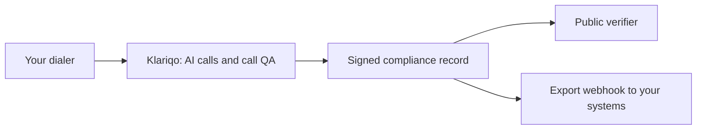

Klariqo is a layer on top of your existing dialer. It does not replace your dialer, your campaigns, or your agents. It handles or reviews the calls that run through your system, checks them against your rules, and produces a signed record of each one.

## The flow

## What happens on a call

- For a Klariqo AI call, the voice agent handles the conversation and can transfer a qualified lead to your human closer.
- For any in-scope call, AI or human-agent, Klariqo reviews it against your scorecard and produces a compliance record, which is a signed vCon.
- The record carries the transcript, a recording reference, the QA result, and sentiment, all signed so that tampering is detectable.
- You can verify any record yourself, and you can have records pushed into your own systems by webhook.

## Where to go next

<CardGroup cols={2}>
  <Card title="The evidence chain" icon="link" href="/compliance-records/evidence-chain">
    A call from audio to verified record, end to end.
  </Card>
  <Card title="Call QA" icon="list-check" href="/call-qa/overview">
    How calls are reviewed against your rules.
  </Card>
  <Card title="Connect VICIdial" icon="phone" href="/dialer-integrations/connect-vicidial">
    Connect Klariqo to your dialer.
  </Card>
  <Card title="Compliance export webhooks" icon="webhook" href="/compliance-export-webhooks/overview">
    Receive every record in your own systems.
  </Card>
</CardGroup>

<Warning>
  Klariqo produces evidence and provenance, not legal compliance. A signed record proves what it contains and that it was not altered. It does not by itself make you compliant. See [trust and honesty boundaries](/start-here/trust-and-honesty).
</Warning>
